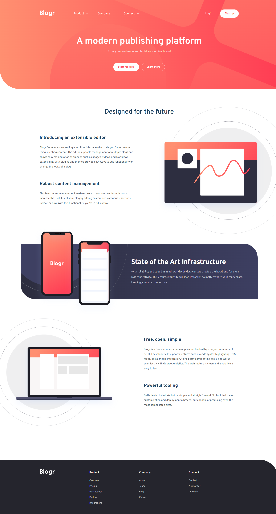

# Frontend Mentor - Blogr landing page solution

This is a solution to the [Blogr landing page challenge on Frontend Mentor](https://www.frontendmentor.io/challenges/blogr-landing-page-EX2RLAApP). Frontend Mentor challenges help you improve your coding skills by building realistic projects.

## Table of contents

- [Overview](#overview)
  - [The challenge](#the-challenge)
  - [Screenshot](#screenshot)
  - [Links](#links)
- [My process](#my-process)

  - [Built with](#built-with)
  - [What I learned](#what-i-learned)
  - [Continued development](#continued-development)

- [Author](#author)

## Overview

### The challenge

Users should be able to:

- View the optimal layout for the site depending on their device's screen size
- See hover states for all interactive elements on the page

### Screenshot

### Links

- Solution URL: [Github Repository](https://github.com/SoftPillow20/blogr-landing-page)
- Live Site URL: [Blogr - Landing Page](https://blogr-bern.netlify.app/)

## My process

### Built with

- Semantic HTML5 markup
- CSS custom properties
- Flexbox
- CSS Grid

### What I learned

I took this challenge because I wanted to build repetition (and be comfortable enough) on writing HTML, CSS and JavaScript. I already learned how to create landing page (in some course tutorials I finished not long ago) with some additional complex components, which is why I wanted to re-create some of it here in this project.

I've also learned how to use git and github. Learning it is one of the best thing I've done for my programming/development phases.

### Continued development

This challenge took me 1 week+ to finish (2 - 4 hours a day) due to some experimentations of ideas and a hard time writing the UI components for this project.

However, this project is not finished yet. I planned to add a login/register component UI, and some simple section transition/animation.

NOTE: The lazy loading feature is unnecessary so I decided not to include one for the images (the images are 5kb max so there's no point in optimizing them).

Also, I noticed that clicking the tab key (which makes the browser focus on a certain element) does not work on some things in this website, such as the navigation links. So, I'm planning to fix the accessibility of this website pretty soon.

Lastly, I've deployed this project through netlify and enabled the continuous development for simple CI/CD capability.

## Author

- Frontend Mentor - [@SoftPillow20](https://www.frontendmentor.io/profile/yourusername)
